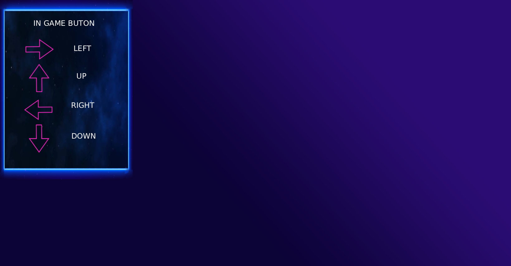
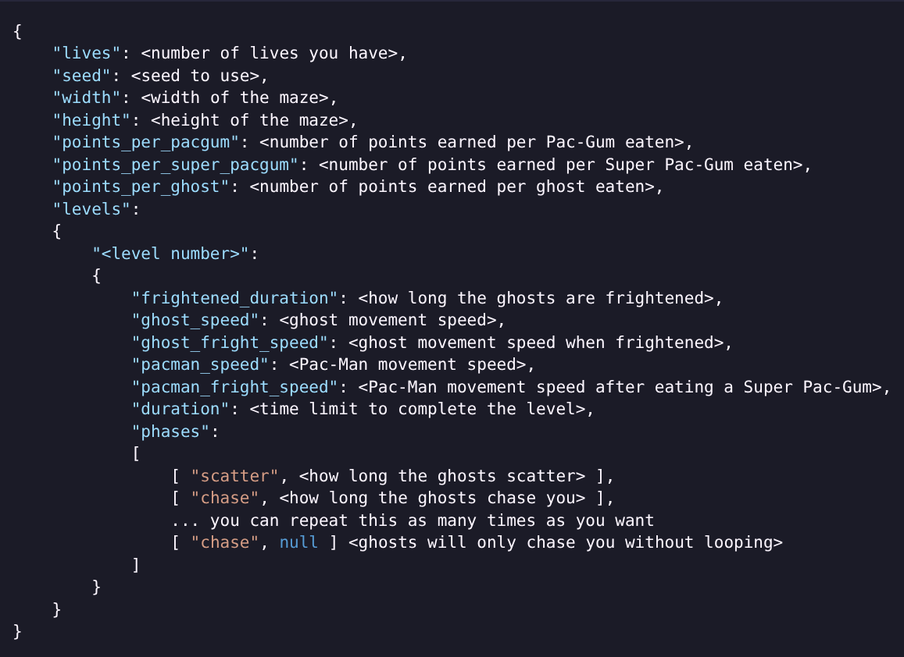
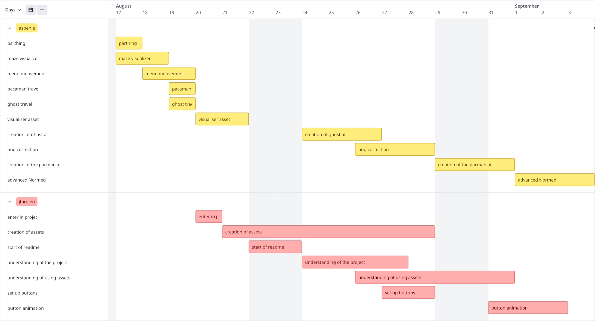
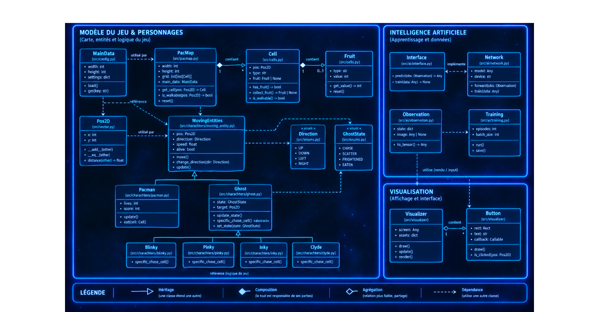
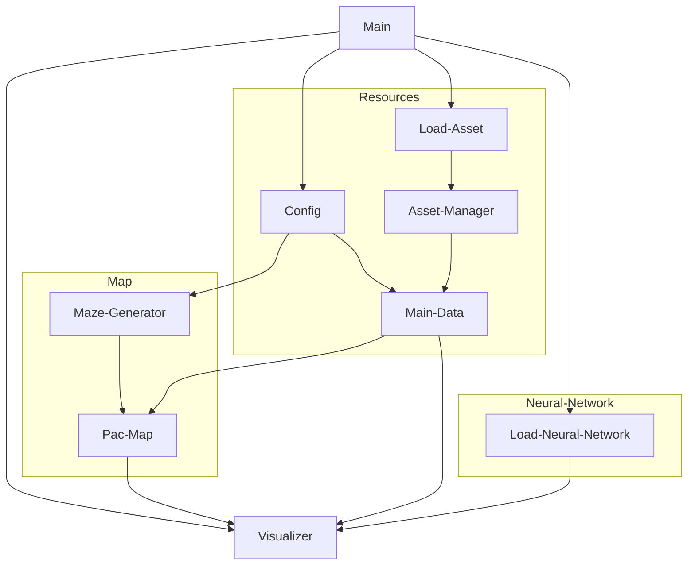
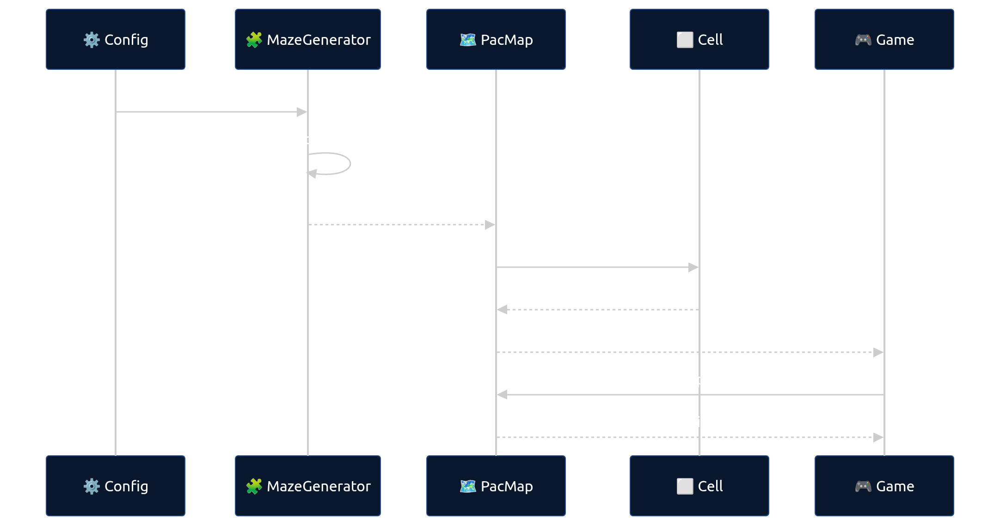

*This project has been created as part of the 42 curriculum by aspenle jtardieu*


# Pac-Man

<table>
  <tr>
    <td>
      
    </td>
    <td align="center">
      <h2>Ghosts! More ghosts!</h2>
    </td>
	<td>
      
    </td>
  </tr>
</table>

## Description

This project aims to reproduce Pacman and post it on a game distribution platform.
Pac-Man is an iconic 1980 maze arcade game developed by Namco and designed by Toru Iwatani.

## 🚀 Quick Start

```bash
uv run python3 pac-man.py <config.json> <verbose>
```
or

```bash
make run
```

## ⚙️ How to Run


| used | for what |
|---------|--------------|
| ```verbose``` | it use to see what asset is load |
| ```config.json``` | it used to create the score board and more

> [!NOTE]
> use with make :

| command | what it does |
|---------|--------------|
| `run` | run the program you can put your config with CONFIG=<put your json file> |
| `verbose` | to run the program with verbose |
| `debug` | to used pdb model for debug |
| `lint` | used to check the norme |
| `lint-strict` | used to check the norme in strict mode |
| `make clean` | 🧹 Remove tempory files |
| `make fclean` | 🗑️ Remove everything (including .venv) |

## 🕹️ How to Used
<tr>
<td align="center">
 
</td>
</tr>

## json

### How to make your config

<table>
  <tr>
    <td colspan="2" align="center"> <h4>you can run without config.json files to use default value</h4></td>
  </tr>
  <tr>
    <td>
      
    </td>
    <td>
      
    </td>
  </tr>
</table>

<details>
<summary>Voir la config JSON</summary>

```json
{
  "lives": <number of lives you have>,
  "seed": <seed to use>,
  "width": <width of the maze>,
  "height": <height of the maze>,
  "points_per_pacgum": <number of points earned per Pac-Gum eaten>,
  "points_per_super_pacgum": <number of points earned per Super Pac-Gum eaten>,
  "points_per_ghost": <number of points earned per ghost eaten>,
  "levels": {
    "<level number>": {
      "frightened_duration": <how long the ghosts are frightened>,
      "ghost_speed": <ghost movement speed>,
      "ghost_fright_speed": <ghost movement speed when frightened>,
      "pacman_speed": <Pac-Man movement speed>,
      "pacman_fright_speed": <Pac-Man movement speed after eating a Super Pac-Gum>,
      "duration": <time limit to complete the level>,
      "phases": [
        ["scatter", <how long the ghosts scatter>],
        ["chase", <how long the ghosts chase you>],
        "... you can repeat this as many times as you want ...",
        ["chase", null <ghost will only chass you without looping>]
      ]
    }
  }
}
```

</details>

### Hot To Made Your score
```json
{
    "Name user" : "score",
    "Max10char" : 999999
}
```
> we use the json to store the high score long terme because it is simple to use and was already used for the config

## 📚 Resources

| need | url |
|------|-----|
| sprite | [sprite resource](https://www.spriters-resource.com/arcade/pacman/) |
| all knowlege | [pacman info](https://pacman.holenet.info/) 📖 |


## time manager



## How its works




### 🧩 Maze Generation


The maze is dynamically generated when the game launches. The configuration notably provides width, height and a seed, which makes it possible to reproduce exactly the same maze when the same seed is used.



### 🔄 what is the principle

The principle can be summarized in four steps:  
Configuration — the game retrieves dimensions and seed.  
Generation — MazeGenerator builds the maze.  
Conversion — the generated structure is used to create the PacMap Cells.  
Gameplay — characters use these cells to know where they can move.  


